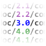

#  FreshMark: Keep your markdown fresh
<!---freshmark shields
output = [
	link(shield('Maven artifact', 'mavenCentral', '{{group}}:{{name}}', 'blue'), 'https://bintray.com/{{org}}/opensource/{{name}}/view'),
	link(shield('Latest version', 'latest', '{{stable}}', 'blue'), 'https://github.com/{{org}}/{{name}}/releases/latest'),
	link(shield('Javadoc', 'javadoc', 'OK', 'blue'), 'https://{{org}}.github.io/{{name}}/javadoc/{{stable}}/'),
	link(shield('License Apache', 'license', 'Apache', 'blue'), 'https://tldrlegal.com/license/apache-license-2.0-(apache-2.0)'),
	'',
	link(shield('Changelog', 'changelog', '{{version}}', 'brightgreen'), 'CHANGES.md'),
	link(image('Travis CI', 'https://travis-ci.org/{{org}}/{{name}}.svg?branch=master'), 'https://travis-ci.org/{{org}}/{{name}}'),
	link(shield('Live chat', 'gitter', 'chat', 'brightgreen'), 'https://gitter.im/{{org}}/{{name}}'),
	'',
	link(shield('Gradle', 'Works with', 'Gradle', 'ff69b4'), '#gradle'),
	link(shield('Console', 'Works with', 'Console', 'ff69b4'), '#console'),
	link(shield('Java API', 'Works with', 'Java API', 'ff69b4'), '#java-api'),
	link(shield('Contribute', 'Works with', 'CONTRIBUTIONS WELCOME', 'ff69b4'), '#how-to-run-it'),
	].join('\n')
-->
[](https://bintray.com/diffplug/opensource/freshmark/view)
[](https://github.com/diffplug/freshmark/releases/latest)
[](https://diffplug.github.io/freshmark/javadoc/1.3.1/)
[](https://tldrlegal.com/license/apache-license-2.0-(apache-2.0))

[](CHANGES.md)
[](https://travis-ci.org/diffplug/freshmark)
[](https://gitter.im/diffplug/freshmark)

[](#gradle)
[](#console)
[](#java-api)
[](#how-to-run-it)
<!---freshmark /shields -->

Generating URL's for the buttons above is tricky.  Once they're generated, it's hard to keep them up-to-date as new versions are released.  FreshMark solves the "Markdown with variables" problem by embedding tiny JavaScript scripts into the comments of your Markdown, which statically generate the rest of the document.  By running these scripts as part of your build script, your project's documentation will always stay up-to-date.

Here is what the code looks like for the shields at the top of this document:

```javascript
<!---freshmark shields
output = [
	link(shield('Maven artifact', 'mavenCentral', '{{group}}:{{name}}', 'blue'), 'https://bintray.com/{{org}}/opensource/{{name}}/view'),
	link(shield('Latest version', 'latest', '{{stable}}', 'blue'), 'https://github.com/{{org}}/{{name}}/releases/latest'),
	link(shield('Javadoc', 'javadoc', 'OK', 'blue'), 'https://{{org}}.github.io/{{name}}/javadoc/{{stable}}/'),
	link(shield('License Apache', 'license', 'Apache', 'blue'), 'https://tldrlegal.com/license/apache-license-2.0-(apache-2.0)'),
	].join('\n')
-->
[](https://bintray.com/diffplug/opensource/freshmark/view)
[](https://github.com/diffplug/freshmark/releases/latest)
[](https://diffplug.github.io/freshmark/javadoc/1.3.1/)
[](https://tldrlegal.com/license/apache-license-2.0-(apache-2.0))
<!---freshmark /shields -->
```

In addition to generating Markdown from scratch, FreshMark can also modify existing Markdown.  This ensures that any inline documentation links stay fresh.

```javascript
<!---freshmark javadoc
output = prefixDelimiterReplace(input, 'https://{{org}}.github.io/{{name}}/javadoc/', '/', stable)
-->
To run FreshMark on some text, call [FreshMark.compile()](https://diffplug.github.io/freshmark/javadoc/1.3.1/com/diffplug/freshmark/FreshMark.html)
<!---freshmark /javadoc -->
```

## How it works

FreshMark has three pieces, `SECTION`, `SCRIPT`, and `BODY`.  They are parsed as shown below:

```javascript
<!---freshmark SECTION
var javascript_here = 'this will be {{templated}} then executed as javascript';
// this particular freshmark script doesn't modify the body at all
output = input;
-->
BODY (markdown)
<!---freshmark /SECTION -->
```

When `SCRIPT` is run, there are two magic variables:

* `input` - This is everything inside of BODY (guaranteed to have only unix newlines at runtime)
* `output` - The script must assign to this variable.  FreshMark will generate a new string where the `BODY` section has been replaced with this value.

Only four functions are provided:

* `link(text, url)` - returns a markdown link
* `image(altText, url)` - returns a markdown image
* `shield(altText, subject, status, color)` - returns a markdown image generated by [shields.io](http://shields.io/).
* `prefixDelimReplace(input, prefix, delimiter, replace)` - updates URLs which contain version numbers.
	* example: for parameters `prefix='http://website/', delimiter='/', replace='2.0'`
	* input `[entry point](http://website/1.2/docs/entryPoint)` would be transformed into `[entry point](http://website/2.0/docs/entryPoint)`

It's full ECMAScript 5.1, so you can define any other functions you like, but these should be all you need.

When you run FreshMark, you can supply it with a map of key-value pairs using the command line or via a properties file.  If you're running FreshMark from a build system plugin such as Gradle, then all of your project's metadata will automatically be supplied.  These key-value pairs are used in the following way:

* Before `SCRIPT` is executed, any `{{key}}` templates will be substituted with their corresponding value.
* When `SCRIPT` is executed, all of these key-value pairs are available as variables.

## How to run it

At the moment, you can run FreshMark using [Gradle](#gradle), the [console](#console), or the [Java API](#java-api) directly.  If you need a different way to run FreshMark, build it and submit a PR!  We'd be happy to help [in Gitter](https://gitter.im/diffplug/freshmark).

### Gradle

Integration with Gradle is provided through the [Spotless](https://github.com/diffplug/spotless) plugin.  Spotless can also enforce lots of style rules as well (tab vs space, Java import ordering, etc), but it's completely a-la-carte.  To just apply FreshMark to all of the markdown in your project (and nothing else), simply add this to your `build.gradle`:

```groovy
plugins {
	id 'com.diffplug.gradle.spotless' version '1.3.1'
}

spotless {
	freshmark {}
}
```

See the [spotless docs](https://github.com/diffplug/spotless) for more details.

### Console

This repo is a command line application.  Just run `freshmark.bat` (Windows) or `freshmark` (Linux and Mac) to run it.

```
usage: freshmark [-P key=value] [-properties FILE] [-endings [PLATFORM_NATIVE | WINDOWS | UNIX]] -file FILE
-P                                     : sets the properties which are available in the script, -P KEY_1=VALUE_1 -P KEY_2=VALUE_2
-properties FILE                       : loads properties from the given file
-endings [PLATFORM_NATIVE | WINDOWS |  : determines the line endings to use in the output (default: PLATFORM_NATIVE)
-file FILE                             : applies freshmark to the given file (multiple are allowed)
```

### Java API

It's a very small [package](src/main/java/com/diffplug/freshmark).  If you want to add more functions, change which variables are there, make the behavior depend on the section name, etc, just take a peek at [FreshMark.java](src/main/java/com/diffplug/freshmark/FreshMark.java).  If you want to build some other kind of "comment language" (generating sections of a document by embedding scripts in its comments) take a look at [CommentScript.java](https://github.com/diffplug/freshmark/blob/master/src/main/java/com/diffplug/freshmark/CommentScript.java) - it's not specific to markdown or HTML-style comments.

## Acknowledgements
* Scripts run by [JScriptBox](https://github.com/diffplug/jscriptbox).
* Bugs found by [findbugs](http://findbugs.sourceforge.net/), [as such](https://github.com/diffplug/durian-rx/blob/v1.0/build.gradle?ts=4#L92-L116).
* Scripts in the `.ci` folder are inspired by [Ben Limmer's work](http://benlimmer.com/2013/12/26/automatically-publish-javadoc-to-gh-pages-with-travis-ci/).
* Built by [gradle](http://gradle.org/).
* Tested by [junit](http://junit.org/).
* Maintained by [DiffPlug](http://www.diffplug.com/).
